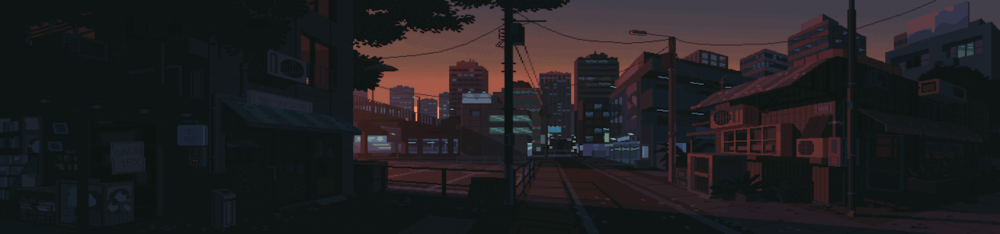

## 🖥 My Software Development Projects
- <b>C (programming language)</b>
  - [Philosopher](https://github.com/Saxsori/Philosopher) (Multithreading, Data races, Unix)
  - [Ray-Cast](https://github.com/Saxsori/ray-cast) (openGL, Math Calculation, 3DGame, Graphics)
  - [PushSwap](https://github.com/Saxsori/Push_Swap) (Algorithm implementation, Sorting algorithms)
  - [Minitalk](https://github.com/Saxsori/minitalk) (Unix logic, Signals, Bitwise operations)
- <b>C++ (object-oriented programming)</b>
  - [CPP Modules](https://github.com/Saxsori/CPP_Modules) (Abstraction, Encapsulation, Inheritance, Polymorphism)
  - [ft_containers](https://github.com/Saxsori/ft_containers) (Templates, Optimization Techniques, Performance Analysis, Memory Management)
- <b>Network and System Administration</b>
  - [Net Practice](https://github.com/Saxsori/Net_Practice) (TCP/IP addressing, Subnetting)
  - [ft_irc](https://github.com/i99dev/ft_irc) (Network protocols, Low-level Network Programming, IRC Protocols, TCP Sockets)
  - [Inception](https://github.com/Saxsori/inception) (Docker CLI, Docker Volumes, Docker Compose, Docker Network, Docker Images, Dockerfile)
- <b> Java (object-oriented programming)</b>
  - [JavaOne](https://github.com/Saxsori/javaOne) (Java Fundamentals, Java Compilation, Docker)
  - [Avaj Launcher](https://github.com/Saxsori/avaj_launcher) (Java, UML, Object-oriented programming, Maven)
- <b> Web Development (Front-end and Back-end)</b>
  - [ft_transendence](https://github.com/i99dev/ft_transcendence) (RESTful API, OAuth2, WebSockets, Tailwind, Nodejs, Nuxtjs, Nestjs, Typescript, Vue, Docker, Nginx, Postgres SQL, Relational Database)
- <b> AI </b>
  - [ft_linear_regression](https://github.com/Saxsori/ft_linear_regression) (Python, Statistics, Gradient Descent, Linear Regression)

	
  
<b>👩🏻‍💻 Github stats</b>

   
  

